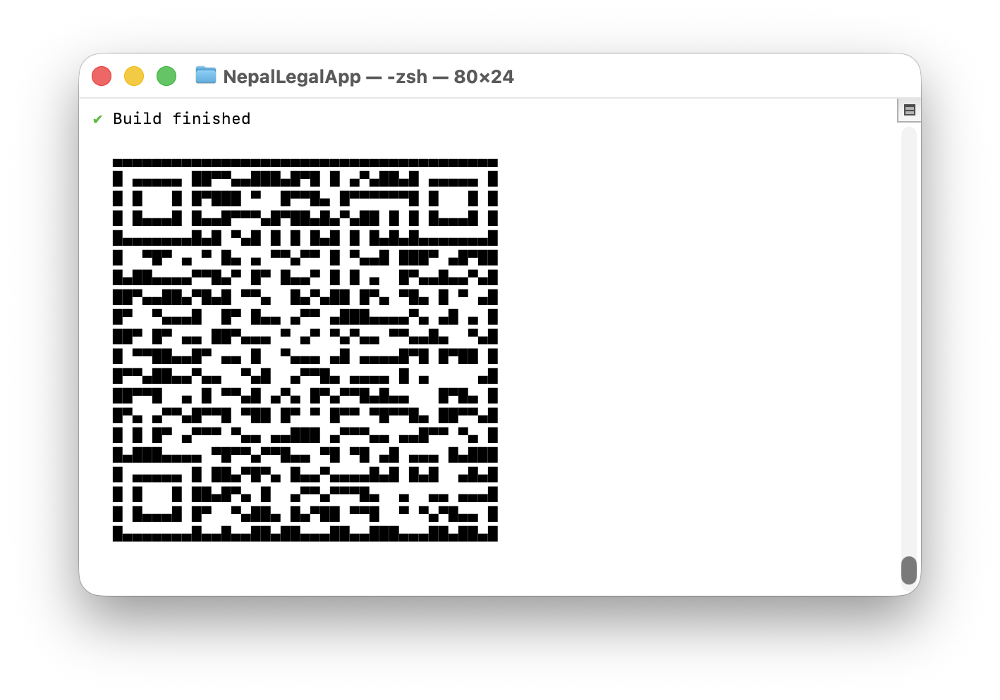

# 🇳🇵 Nepal Legal AI System

**A Complete End-to-End Legal AI Solution for Nepal's National Penal Code, 2017**

An integrated legal AI system combining Retrieval-Augmented Generation (RAG), Fine-Tuned Large Language Models (LLM),REST APIs, Web UI, and Android Mobile App to deliver accurate, grounded legal assistance for Nepali law.

---

## 🎯 Project Overview

This repository represents a **full-stack legal AI engineering project** that transforms official legal documents into an intelligent, accessible system. The project demonstrates:

✅ **Complete Legal Data Pipeline** — PDF extraction → structured chunking → embeddings  
✅ **Dual AI Approaches** — RAG for retrieval + Fine-tuned LLM for reasoning  
✅ **Production Deployment** — REST APIs + Interactive Web Interface  
✅ **Multi-Client Support** — Web UI + Android App

✅ **Legal Traceability** — Every answer linked to specific law sections  
✅ **Open Source & Reproducible** — Fully documented methodology

---

## 🏗️ System Architecture


This diagram illustrates the **complete lifecycle** of the Nepal Legal LLM:


---

## 🚀 Live Deployments

### 🌐 Web Applications

| Application | Description | Link |
|------------|-------------|------|
| **Streamlit UI** | Main user interface | [Live App](https://streamlet-api-run-fqzqybojx2kq5pryqdqgm7.streamlit.app) |
| **GGUF Assistant** | Low-RAM optimized version | [HF Space](https://huggingface.co/spaces/yamraj047/Nepall-legal-assist) |
| **Full-Precision** | High-accuracy legal reasoning | [HF Space](https://huggingface.co/spaces/yamraj047/penal-legal-assistant) |
| **Fast API** | Optimized backend inference | [HF Space](https://huggingface.co/spaces/yamraj047/nepal-legal-assistant-fast) |

### 🔌 API Endpoints

| Endpoint | Type | URL |
|----------|------|-----|
| **GGUF API** | Production | [API Docs](https://yamraj047-api-nepal-legal-llm-gguf.hf.space/docs) |
| **Standard API** | Full-Precision | [API Docs](https://yamraj047-api-nepal-legal-llm.hf.space/docs) |

### 🤗 Models on Hugging Face

| Model | Format | Size | Downloads |
|-------|--------|------|-----------|
| [Nepal Legal Mistral-7B](https://huggingface.co/yamraj047/nepal-legal-mistral-7b) | FP16 | 13.5 GB | Main Model |
| [Nepal Legal Mistral-7B GGUF](https://huggingface.co/yamraj047/nepal-legal-mistral-7b-GGUF) | Q4_K_M | 4.07 GB | CPU Optimized |
| [Community GGUF Variants](https://huggingface.co/mradermacher/nepal-legal-mistral-7b-GGUF) | Q2-Q8 | Various | Community Build |

---

### 📱 Android Mobile Application

A native **Android legal assistant app** built using **Expo + React Native**, powered entirely by the production Nepal Legal AI API.

**Key Features:**
- Chat-based legal question answering
- Real-time responses from GGUF-optimized LLM
- Uses the same grounded RAG + LLM backend as the web system
- Lightweight client (no on-device model inference)
- Designed for accessibility and low-resource devices

**Backend API Used:**
https://yamraj047-api-nepal-legal-llm-gguf.hf.space
___

**Android Build (Expo):**
- 🔗 **Download / Install Build:**  
  https://expo.dev/accounts/yamraj047/projects/NepalLegalApp/builds/0594c69b-3a54-47ab-893a-c5f78fa668b2

> ⚠️ *Note:* This is an Expo build intended for testing and demonstration purposes.  
> The app communicates with the live production API and does not store legal data locally.
---

## 📷 Document Scanner (Android – Experimental)

The Android app includes an **on-device document scanning feature** designed for capturing **physical legal documents** (e.g., court notices, printed laws, handwritten notes) **after the app is installed**.

> 📌 **Important**  
> The QR code provided above is **only for installing the Android app (Expo build)**.  
> It is **not related to the document scanner feature**.

### Capabilities
- Scan documents using the device camera  
- Auto-crop and perspective correction  
- Convert scanned pages into readable images  
- Prepare documents for future **OCR + Legal AI analysis**  

### Current Status
- ⚙️ Available inside the installed Android app *(experimental)*  
- 🧪 Used only for document capture *(no automatic OCR or AI analysis yet)*  
- 🚧 Planned integration with **OCR + RAG pipeline**  

### Purpose
This scanner lays the foundation for **multi-modal legal assistance**, enabling future workflows such as:
- Scanned document → OCR → Legal chunking → AI explanation  
- Uploading court papers for simplified legal understanding  
- Offline-first document capture for low-connectivity regions  

---

## 📸 Document Scanner Preview (Android)



---

## 📦 Repository Structure

```
nepal-legal-ai-system/
│
├── 1-rag-system/                 # RAG Pipeline
│   ├── pdf->text_nochunk/
│   ├── chunk_id-add/
│   ├── embedding/
│   └── app.py
│
├── 2-fine-tuning/                # LLM Fine-Tuning
│   ├── pdf->text_nochunk/
│   ├── chunk_id-add/
│   ├── metadata/
│   ├── training/
│   └── I-i-o-metadata/
│
├── 3-production-api/             # Production Backend
│   ├── backend/
│   │   ├── llm.py
│   │   ├── rag_pipeline.py
│   │   ├── prompts.py
│   │   └── main.py
│   ├── vectorstore/
│   ├── config/
│   └── requirements.txt
│
├── frontend/                     # Frontend Layer (Unified)
│   │
│   ├── streamlit-frontend/       # ✅ Current UI (Active)
│   │   ├── app.py
│   │   ├── components/         # (optional later)
│   │   └── requirements.txt
│   │
│   └── react-frontend/           # 🚧 Future UI (Planned)
│   |    ├── README.md             # Explain future plan
│   |    └── .gitkeep              # Keep folder tracked
│   |     
|   |____android-app/              # Android app (API-based)                
|
```

---

## 🔧 Technology Stack

### Core Technologies
- **Python 3.9+** — Primary language
- **PyMuPDF** — PDF text extraction
- **Sentence Transformers** — Embedding generation (`all-mpnet-base-v2`)
- **FAISS** — Vector similarity search
- **Mistral-7B** — Base LLM for fine-tuning
- **CTransformers** — GGUF inference engine

### Frameworks & Libraries
- **FastAPI** — REST API backend
- **Streamlit** — Web interface
- **Hugging Face Transformers** — Model loading & inference
- **llama-cpp-python** — CPU-optimized inference

### Deployment
- **Hugging Face Spaces** — API hosting
- **Streamlit Cloud** — Frontend hosting
- **Docker** — Containerization

---

## ⚙️ Installation & Setup

### 1️⃣ Clone All Repositories

```bash
# RAG System
git clone https://github.com/e-wakil/RAG-Penal-code-Nepal.git

# Fine-Tuning
git clone https://github.com/e-wakil/Fine-tuning-penal-code-Nepal.git

# Frontend
git clone https://github.com/yamrajkhadka/streamlet-api-run.git
```

### 2️⃣ Run RAG System Locally

```bash
cd RAG-Penal-code-Nepal
python3 -m venv venv
source venv/bin/activate  # On Windows: venv\Scripts\activate
pip install -r requirements.txt

# Set API key
export GROQ_API_KEY="your_groq_api_key_here"

# Run application
streamlit run app.py
```

### 3️⃣ Run Fine-Tuned Model (GGUF - CPU Optimized)

```bash
# Install dependencies
pip install llama-cpp-python huggingface-hub

# Run interactive terminal
python3 -c "from llama_cpp import Llama; from huggingface_hub import hf_hub_download; m=Llama(hf_hub_download('yamraj047/nepal-legal-mistral-7b-GGUF','nepal-legal-Q4_K_M.gguf'),n_ctx=2048); print(m(input('Q: '),max_tokens=300)['choices'][0]['text'])"
```

### 4️⃣ Run Full-Precision Model

```bash
pip install transformers torch accelerate sentencepiece

python3 -c "from transformers import pipeline; p=pipeline('text-generation','yamraj047/nepal-legal-mistral-7b'); print(p(input('Q: '), max_new_tokens=300)[0]['generated_text'])"
```

### 5️⃣ Call Production API

```bash
curl -X POST "https://yamraj047-api-nepal-legal-llm-gguf.hf.space/ask" \
  -H "Content-Type: application/json" \
  -d '{"question": "What is the penalty for theft in Nepal?"}'
```

---

## 🧪 Example Usage

### Question
```
"How is liability determined for someone who assists a minor in committing an offense?"
```

### Retrieved Context (RAG)
```
[Chapter 3, Section 45] Any person who aids or abets a minor...
[Chapter 3, Section 46] Liability shall be reduced if...
```

### AI Response
```
According to the National Penal Code 2017, when an adult assists a minor 
in committing an offense, liability is determined based on the nature of 
assistance and the minor's age. Under Chapter 3, Section 45, adults who 
knowingly aid minors in criminal acts bear full responsibility...
```

---

## 📊 Project Components

### 1️⃣ RAG Pipeline
**Repository:** [RAG-Penal-code-Nepal](https://github.com/e-wakil/RAG-Penal-code-Nepal)

**Key Features:**
- Faithful PDF → Text extraction
- Hierarchical legal chunking (Part → Chapter → Section → Subsection)
- Vector embeddings for semantic search
- FAISS-based retrieval
- Groq API integration (LLaMA-3.1-8B)

**Process:**
```
PDF → Clean Text → Legal Chunks → Embeddings → Vector DB → Retrieval
```

### 2️⃣ Fine-Tuned LLM
**Repository:** [Fine-tuning-penal-code-Nepal](https://github.com/e-wakil/Fine-tuning-penal-code-Nepal)

**Key Features:**
- Instruction dataset generation
- Mistral-7B fine-tuning
- GGUF quantization (13.5GB → 4GB)
- CPU-optimized inference
- Community adoption & re-quantization

**Process:**
```
Legal Text → Instruction Dataset → Fine-Tuning → Quantization → Deployment
```

### 3️⃣ Production API
**Repository:** API spaces on Hugging Face

**Key Features:**
- FastAPI REST endpoints
- GGUF model inference (CTransformers)
- Vector store integration
- CORS-enabled for web access
- Comprehensive logging

**Endpoints:**
- `GET /` — Health check
- `GET /health` — System status
- `POST /ask` — Legal question answering

### 4️⃣ Streamlit Frontend
**Repository:** [streamlet-api-run](https://github.com/yamrajkhadka/streamlet-api-run)

**Key Features:**
- Clean, intuitive interface
- Real-time API communication
- Response streaming
- Error handling
- Deployed on Streamlit Cloud

---

## 🎓 Educational Value

This project demonstrates:

✅ **End-to-End ML Pipeline** — Data → Training → Deployment  
✅ **Production Best Practices** — Logging, error handling, API design  
✅ **Legal AI Ethics** — Transparency, traceability, no hallucination  
✅ **Resource Optimization** — GGUF quantization for CPU inference  
✅ **Open Source Principles** — Reproducible, documented, shareable

---

## 📈 Impact & Adoption

- **Community Re-quantization:** Model adopted within 24 hours by [mradermacher](https://huggingface.co/mradermacher/nepal-legal-mistral-7b-GGUF)
- **Multiple Deployments:** 4 live applications + 2 production APIs
- **Format Diversity:** FP16, GGUF Q4, community Q2-Q8 variants
- **CPU Accessibility:** 4GB model runs on consumer hardware

---

## ⚠️ Legal Disclaimer

**This system is for educational and informational purposes only.**

❗ **NOT a substitute for professional legal advice**  
❗ Always consult qualified legal professionals for legal matters  
❗ The AI may make mistakes — verify critical information

---

## 🗺️ Future Roadmap

- [ ] Multi-law support (Civil Code, Evidence Act, Constitution)
- [ ] Nepali language interface (देवनागरी script)
- [ ] Cross-reference detection between laws
- [ ] Citation-aware prompting
- [ ] Mobile application
- [ ] Offline-first architecture
- [ ] Multi-modal support (images, scanned documents)

---

## 👤 Author

**Yamraj Khadka**  
Computer Engineering Student, Nepal 🇳🇵

- 🐙 GitHub: [@yamrajkhadka](https://github.com/yamrajkhadka)
- 🤗 Hugging Face: [@yamraj047](https://huggingface.co/yamraj047)
- 📧 Contact: [via GitHub](https://github.com/yamrajkhadka)

---

## 🙏 Acknowledgments

- **Source:** [National Penal Code Act, 2017](https://bwcimplementation.org/sites/default/files/resource/NP_National%20Penal%20Code%20Act_EN.pdf)
- **Community:** Special thanks to [mradermacher](https://huggingface.co/mradermacher) for community GGUF builds
- **Frameworks:** Hugging Face, Sentence Transformers, FastAPI, Streamlit

---

## 📝 Citation

If you use this project in your research or work, please cite:

```bibtex
@software{khadka2025nepal_legal_ai,
  author = {Khadka, Yamraj},
  title = {Nepal Legal AI System: End-to-End Legal RAG and Fine-Tuned LLM},
  year = {2025},
  publisher = {GitHub},
  url = {https://github.com/yamrajkhadka/nepal-legal-ai-system}
}
```

---

## 🌟 Support This Project

If this work helped you:

- ⭐ Star this repository
- 🍴 Fork and build upon it
- 📢 Share with others
- 💬 Provide feedback

---

## 📄 License

This project is open source and available for educational purposes.  
Individual components may have their own licenses — see respective repositories.

---

## 🔗 Related Repositories

1. **RAG System:** [e-wakil/RAG-Penal-code-Nepal](https://github.com/e-wakil/RAG-Penal-code-Nepal)
2. **Fine-Tuning:** [e-wakil/Fine-tuning-penal-code-Nepal](https://github.com/e-wakil/Fine-tuning-penal-code-Nepal)
3. **Frontend:** [yamrajkhadka/streamlet-api-run](https://github.com/yamrajkhadka/streamlet-api-run)

---

**Built with ❤️ for Nepal's legal accessibility**

*Empowering citizens through AI-powered legal information*
